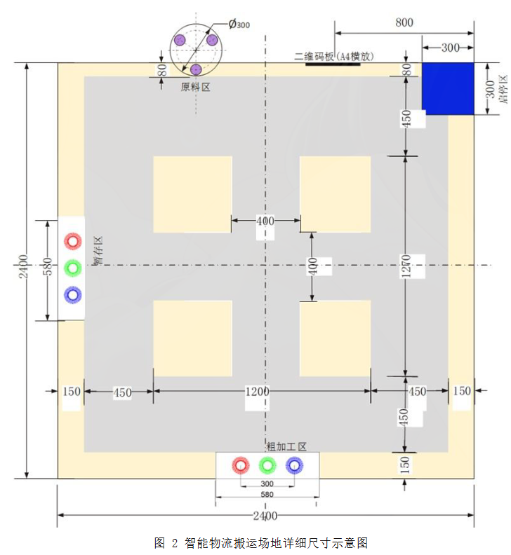
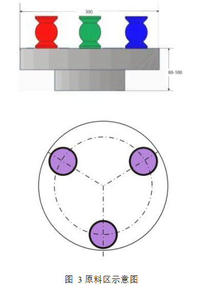
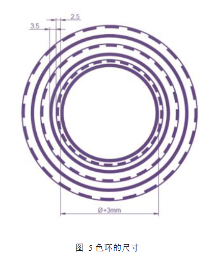

# AI进行开发的关键点——明确AI的能力边界

*以及任务介绍*

本文为使用AI开发工训赛智能物流赛道视觉部分的第0课。最终目的是告诉各位，在AI时代进行计算机视觉开发时，最低限度需要知道什么。

## 一、引言：同样用 AI，为什么产出天差地别？

一个外行和一个工程师，用同一个模型做同一个需求——写出来的代码、方案的可靠性、踩坑的数量，完全不同。差距不在模型，在**工程理解**。

本课要回答的问题就是：**"至少理解到什么程度，AI 才能真正为你所用？"**

---

## 二、AI 的能力边界

### 2.1 AI 擅长什么

- 生成代码骨架、写样板逻辑
- 解释报错信息、查 API 文档
- 把模糊需求翻译成具体实现

### 2.2 AI 不擅长什么

- 判断方案的整体合理性——它能写，但不知道写的对不对路
- 调试你的特定运行环境——它看不到你实际运行时的状态
- 识别边缘 case——它能覆盖常规路径，但意外只发生在你没问到的地方

### 2.3 关键认知：代码能跑 ≠ 方案正确

AI 输出的代码几乎都能跑。但这恰恰是陷阱——外行看到"跑起来了"就觉得完了，有经验的工程师看到"跑起来了"只是开始。能判断一段代码是否值得保留、一个方案是否经得起迭代，靠的是工程理解。

---

## 三、最低认知基线：你至少要知道什么

### 3.1 算法选型

你需要知道传统 CV 和深度学习的基本区别，以及它们各自适合的场景

- 传统 CV（OpenCV / 图像处理）：可控、可调试、轻量、不依赖数据
- 深度学习（YOLO / 分类网络）：需要数据、训练复杂、黑箱

选型原则？没有什么固定的选型原则。这正是你心中所想的“那个东西”和AI写出来的不一样的原因。

### 3.2 代码阅读

不需要逐行背诵，但能跟踪数据流

- 知道输入是什么、经过哪些步骤、输出什么
- 能画出大致的数据流向即可

### 3.3 基本调试

很多场景下的调试AI是可以辅助做到的。但计算机视觉的实际运行效果恰好是不好被AI评估的一环。
尽管可以调用多模态模型进行图片理解甚至额外使用视频理解模型，但我们也要考虑到钱包的厚度。

- 调试能力是 AI 辅助开发中最不能被替代的一环
- AI 可以帮你读报错，现在也可以通过tool实际操作进行调试，但它不能完全替代你的调试能力
- 一旦AI无法确定错误，排错依然需要靠你自己。

### 3.4 方案评估

AI 给的方案，你能判断它是靠谱还是离谱

- AI 会自信满满地给出一个完全不可行的方案
- 你需要的最低能力是判断这个方案完全是空中楼阁或者不可能达到理想效果
- 这种判断能力就是对于方案能力边界的理解。

---

## 四、视觉任务介绍

视觉任务在场地中有三个部分可用到，分别是扫描二维码获取任务、原料区旋转台上物料识别、加工区圆环识别（包括码垛）。

---

## 五、结语

在我们这个智能物流赛道的视觉开发项目种，你没有必要成为 CV 专家。但如果你想用 AI 做好一个项目，你需要越过一条最低的认知基线。否则你将不知道你在写些什么。

在后续的课程中，我们将会使用AI来进行智能物流赛道视觉部分的开发。我们只会对其提供必要的方案与要求。
